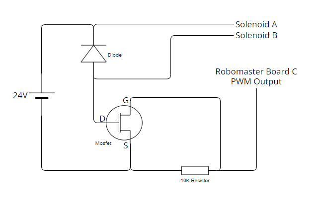
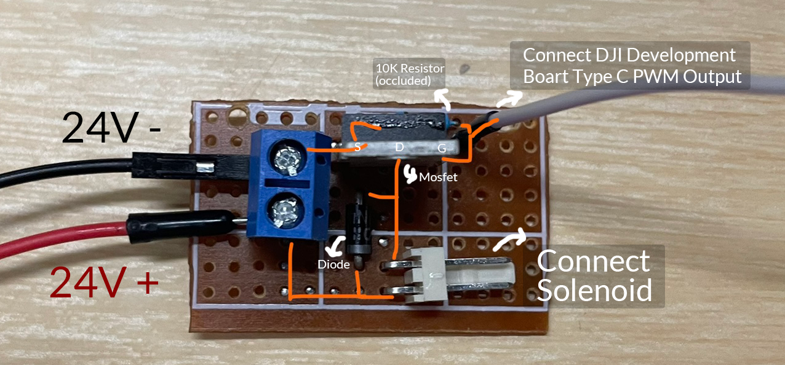
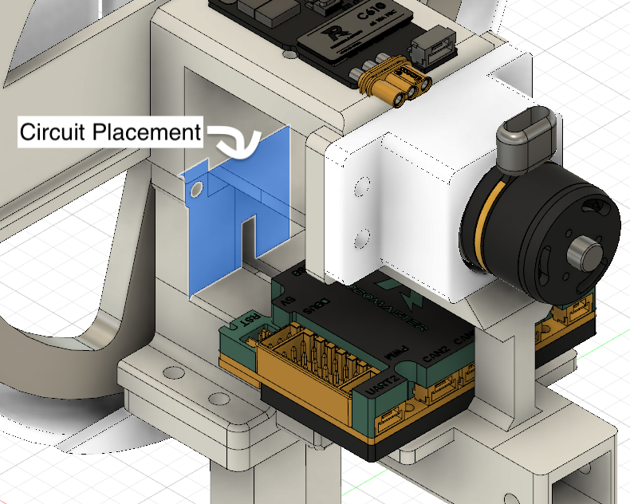

# KK-0530B Activation Circuit

## Overview
The KK-0530B component requires a 24V power supply to operate. However, the 24V output from the RoboMaster Development Board Type C lacks direct controllability. To overcome this limitation, we have designed and integrated a simple yet effective additional circuit.

## Solution
We use a Mosfet to manage the power activation. This allows us to control the 24V power supply by utilizing a 3.3V PWM signal from the development board. This integration not only solves the controllability issue but also maintains the compactness of our system.

## Circuit Design
The design of the circuit is straightforward and occupies minimal space, making it ideal for tight integrations. Below are the resources for our circuit implementation:

### Circuit Diagram
View the schematic of the circuit we used here: 

    

### Implementation Photo
Here is how the circuit looks when implemented in a small space:<be>

    

### Circuit Placement
The circuit was placed near the control board:<be>

    

This integration not only enables the functionality of the KK-0530B but also ensures that the setup remains compact and efficient.
